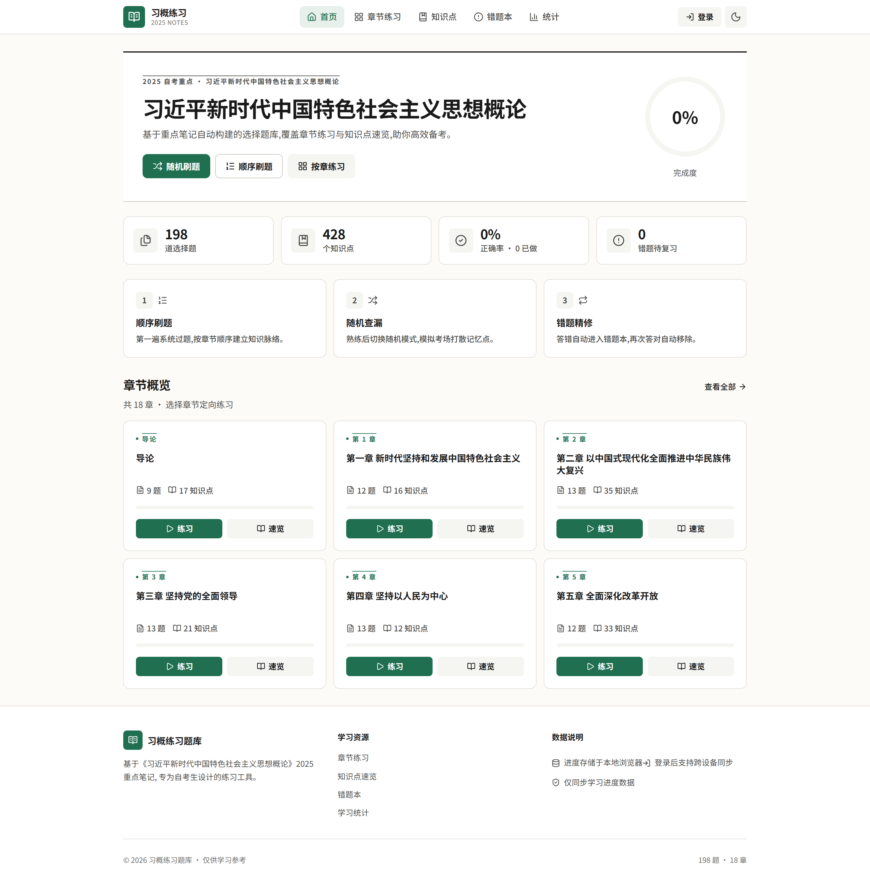
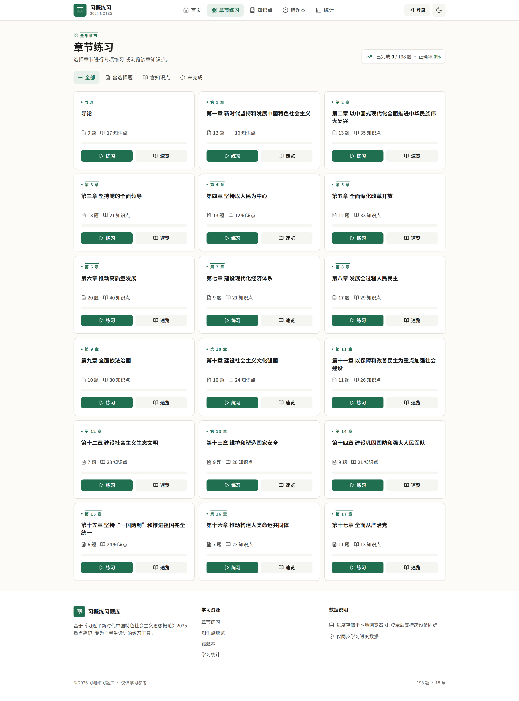
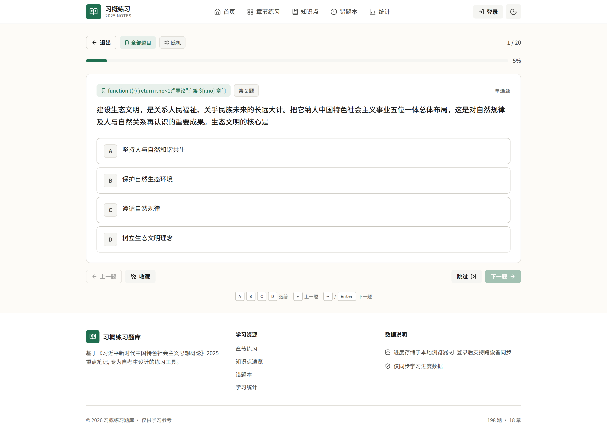
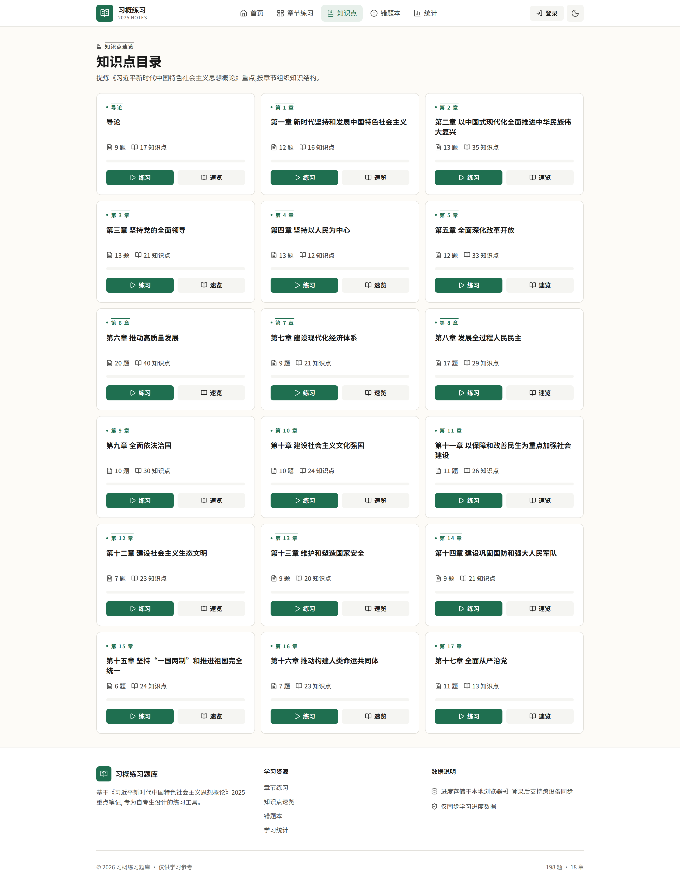
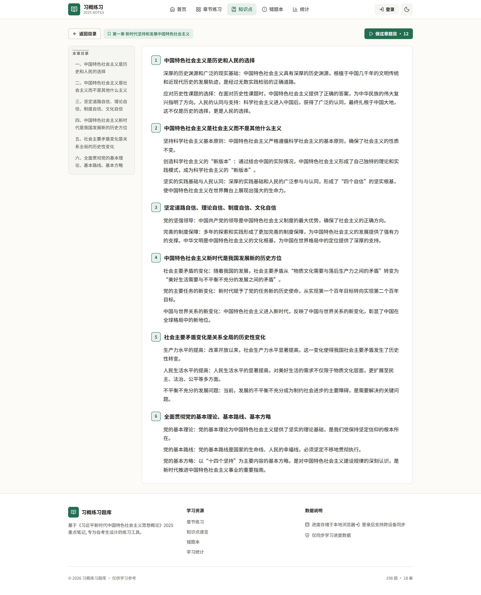
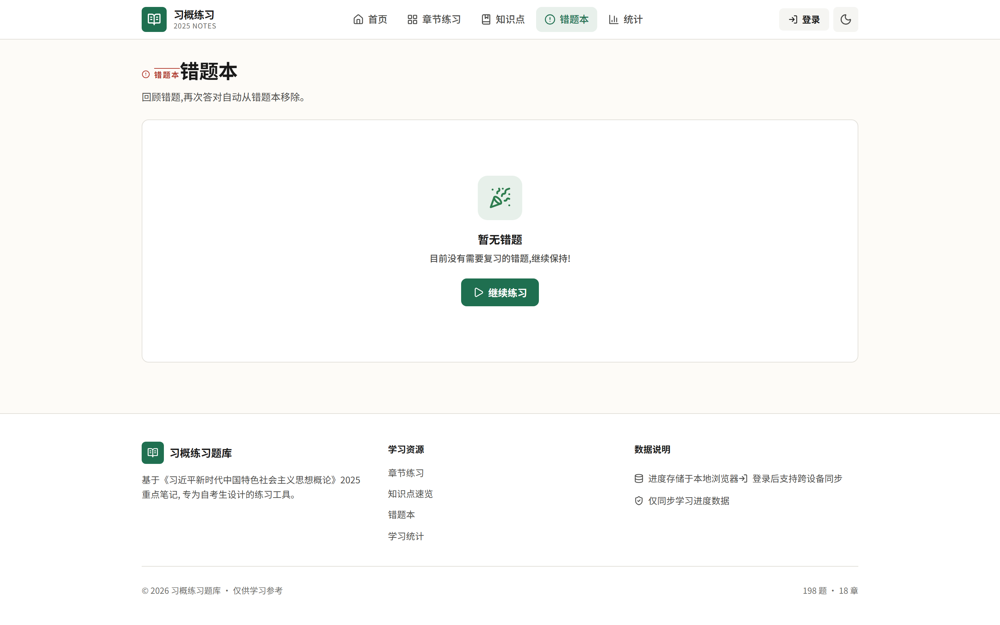
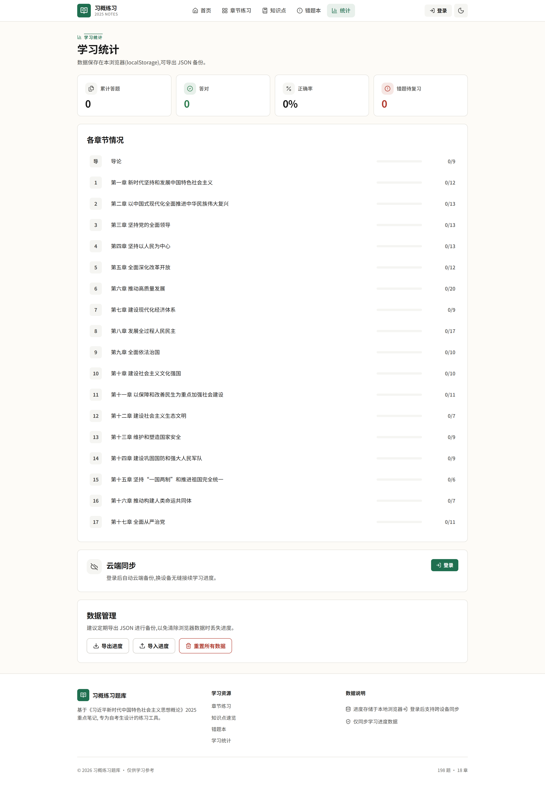
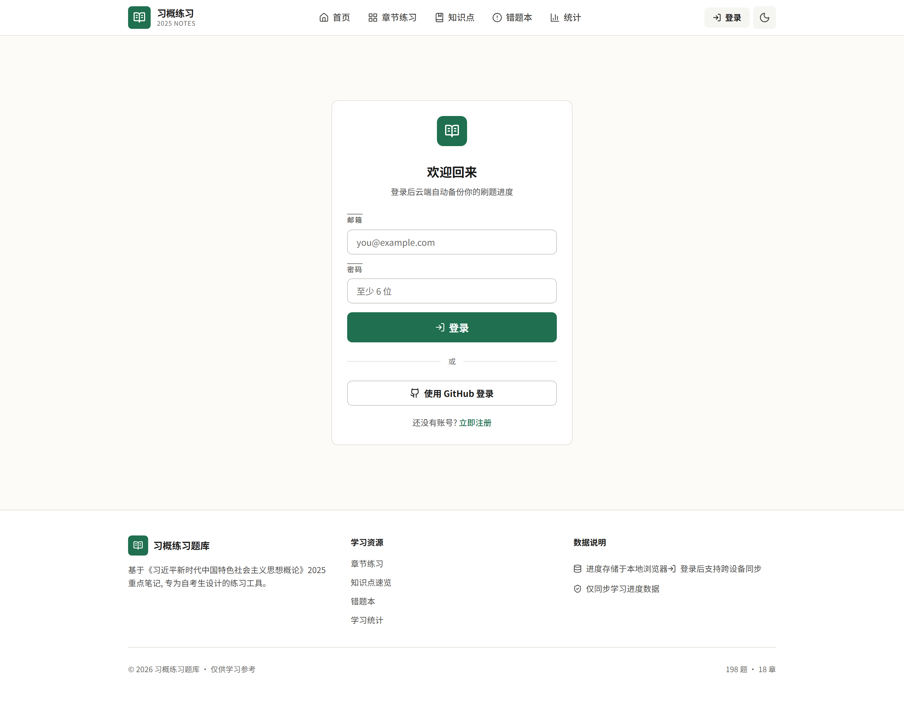
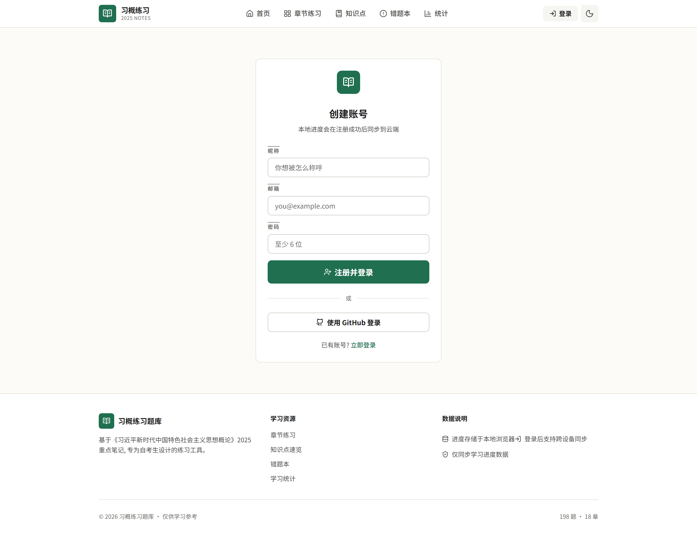
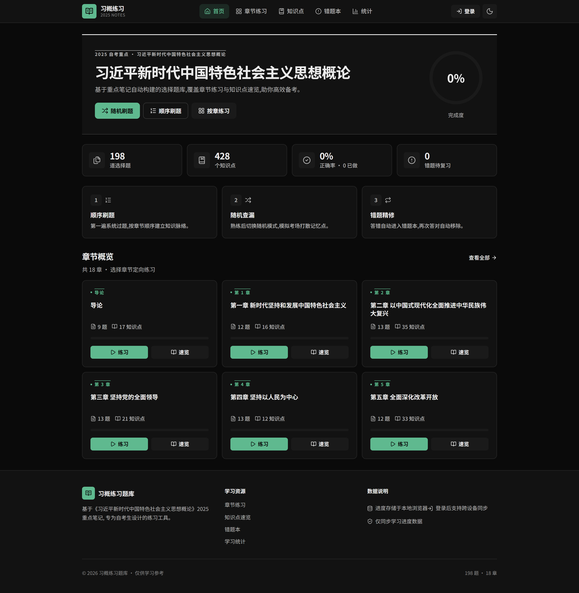

# 习概练习题库 · Nuxt 3 SSR

把《2025习概重点笔记.pdf》自动解析为可练习的 **选择题题库 + 知识点速览**,并提供一个基于 Nuxt 3 的 SSR 网页应用,支持账号登录后跨设备同步刷题进度。

**线上体验:** <https://quiz.zxbdwy.online>

- 选择题:**198 道**(题干 / 4 选项 / 正确答案 / 笔记原版解析)
- 知识点:**428 条**,覆盖导论 + 17 章
- 技术栈:**Nuxt 3 (SSR) + TypeScript + Pinia + Tailwind CSS + better-auth + Drizzle ORM + SQLite**
- API:`/api/bank` `/api/meta` `/api/chapter/:id` `/api/random` `/api/questions` `/api/sync/state` `/api/auth/*`
- 数据:本地 localStorage + 登录后服务端 SQLite 双写,自动合并多端进度
- 部署:Docker / Docker Compose 一键启动,内置 SSR + better-sqlite3

## 截图

> 截图来自线上环境 <https://quiz.zxbdwy.online>。

### 首页 · 刊头 + KPI + 章节概览



### 章节练习列表



### 答题(随机模式)



### 知识点速览目录



### 单章知识点详情(带锚点目录)



### 错题本(空状态)



### 学习统计 + 云同步入口 + 导入导出



### 登录(邮箱 / GitHub)



### 注册



### 暗色模式



## 目录结构

```
xige-quiz-nuxt/
├─ app.vue                      # 应用根 + 防 FOUC 内联脚本
├─ nuxt.config.ts               # SSR + node-server + serverAssets + routeRules
├─ tailwind.config.ts           # CSS 变量映射(墨纸专注风)
├─ Dockerfile                   # 多阶段构建,内含 better-sqlite3 原生编译
├─ docker-compose.yml           # host 网络 + SQLite 卷持久化
├─ drizzle.config.ts            # Drizzle Kit 配置
├─ drizzle/                     # 数据库迁移(启动时自动执行)
├─ assets/css/main.css          # CSS 变量(亮/暗)+ Tailwind
├─ components/
│  ├─ AppHeader.vue / AppFooter.vue
│  ├─ ChapterCard.vue / QuestionCard.vue
│  ├─ UiDialog.vue / AppDialogHost.vue   # 全局对话框(替代原生 confirm)
│  ├─ UiProgress.vue / UiProgressRing.vue
│  ├─ AuthCard.vue / SyncStatus.vue       # 登录卡片 + 同步状态指示器
│  ├─ ThemeToggle.vue / EmptyState.vue / Spinner.vue / SkeletonCard.vue
├─ composables/
│  ├─ useBank.ts                # 数据入口(meta / bank / chapter / random / questions)
│  ├─ useChapterLabel.ts        # 全站章节标签真源
│  ├─ usePracticeSession.ts     # 答题状态机
│  ├─ useCloudSync.ts           # 云端同步(模块级单例)
│  ├─ useEmailAuth.ts           # 邮箱登录/注册表单
│  ├─ useConfirm.ts             # 全局对话框
│  └─ useTheme.ts / useImportValidation.ts
├─ pages/
│  ├─ index.vue                 # 首页 hero + KPI + 章节概览
│  ├─ chapters.vue              # 全部章节 + 过滤器
│  ├─ practice/[mode].vue       # 答题(sequential | random | wrong)
│  ├─ kp/index.vue              # 知识点目录
│  ├─ kp/[id].vue               # 单章知识点(锚点 TOC)
│  ├─ wrong.vue                 # 错题本(复用 QuestionCard 只读态)
│  ├─ stats.vue                 # 统计 + 云同步 + 导入导出
│  ├─ login.vue / signup.vue    # 认证页(邮箱 + GitHub)
├─ plugins/
│  └─ theme.client.ts           # 客户端启动同步 dark class
├─ server/
│  ├─ data/bank.json            # 已生成的题库(198 题 + 428 知识点)
│  ├─ db/
│  │  ├─ schema.ts              # users / sessions / accounts / quiz_state
│  │  └─ index.ts               # better-sqlite3 + 启动时自动 migrate
│  ├─ utils/bank.ts             # 题库加载与缓存(Nitro storage 兜底)
│  └─ api/
│     ├─ bank.get.ts            # GET /api/bank
│     ├─ meta.get.ts            # GET /api/meta
│     ├─ chapter/[id].get.ts    # GET /api/chapter/:id
│     ├─ random.get.ts          # GET /api/random?count=10&chapter=ch_一
│     ├─ questions.get.ts       # GET /api/questions?ids=a,b,c
│     ├─ auth/[...all].ts       # better-auth 路由(邮箱 + GitHub OAuth)
│     └─ sync/state.{get,post}.ts # 云端同步读写
├─ stores/quiz.ts               # Pinia(history/wrong/mark/theme,持久化)
├─ types/bank.ts                # Bank / Mcq / Chapter / Letter 等类型
├─ lib/                         # better-auth 客户端 / 工具
├─ scripts/
│  └─ screenshot.mjs            # Playwright 截图脚本(本 README 用)
└─ tools/                       # PDF → 题库生成器(Python + pdfplumber)
   ├─ extract_pdf.py            # PDF → tools/raw_pages.json
   ├─ build_bank.py             # → server/data/bank.json
   ├─ analyze.py
   └─ peek.py
```

## 本地运行

需要 Node.js 18+ 和 pnpm。

```bash
cd xige-quiz-nuxt
pnpm install
pnpm dev               # 启动开发服务器 http://localhost:3000
```

> 如果遇到 `ERR_PNPM_IGNORED_BUILDS` 阻断,本仓库已在 `.npmrc` 关闭 `verify-deps-before-run`,以及在 `package.json` 配置了 `pnpm.onlyBuiltDependencies`。若仍报错,可直接用 `./node_modules/.bin/nuxt dev` 启动。

常用脚本:

| 命令 | 作用 |
| --- | --- |
| `pnpm dev` | 开发服务器 |
| `pnpm build` | 生产构建(node-server preset) |
| `pnpm preview` | 本地预览生产产物 |
| `pnpm typecheck` | `vue-tsc` 类型检查 |
| `pnpm db:generate` | Drizzle 生成迁移 |
| `pnpm db:migrate` | Drizzle 执行迁移(运行时也会自动执行) |
| `pnpm db:studio` | Drizzle 可视化 |
| `pnpm build:bank` | 重新解析 PDF → `server/data/bank.json` |

## 生产部署

### 方式一:Docker Compose(推荐)

```bash
cp prod.env.example prod.env     # 填入 BETTER_AUTH_SECRET / GitHub OAuth 等
docker compose up -d --build
# 容器使用 host 网络,直接监听宿主机 3000 端口
# SQLite 数据持久化到 named volume: quiz_data
```

环境变量(`prod.env`):

| 变量 | 说明 |
| --- | --- |
| `BETTER_AUTH_SECRET` | better-auth 会话签名密钥(必填) |
| `BETTER_AUTH_URL` | 站点对外 URL,如 `https://quiz.zxbdwy.online` |
| `GITHUB_CLIENT_ID` / `GITHUB_CLIENT_SECRET` | GitHub OAuth 凭据(可选,缺失时隐藏 GitHub 登录入口) |
| `NUXT_PUBLIC_HAS_GITHUB_LOGIN` | 运行时显式开启 GitHub 登录入口(覆盖构建期检测) |
| `HTTPS_PROXY` / `HTTP_PROXY` | 服务端出网代理(GitHub OAuth 必需) |

### 方式二:裸 Node

```bash
pnpm build                                  # 产物在 .output/
node .output/server/index.mjs               # Node 18+ 即可启动
```

其他 Nitro preset(改 `nuxt.config.ts` 中的 `nitro.preset`):

- Cloudflare Workers(`cloudflare`)— 需要把 SQLite 改为 D1 / Turso
- Vercel(`vercel`) / Netlify(`netlify`)— 需要外接持久数据库

## 数据流

```
PDF (《2025习概重点笔记.pdf》)
   │  python tools/extract_pdf.py
   ▼
tools/raw_pages.json
   │  python tools/build_bank.py
   ▼
server/data/bank.json   (198 道题 + 428 知识点)
   │  /api/bank  /api/meta  /api/chapter/:id ...
   ▼
浏览器(Vue 组件 + Pinia 状态)
   │  localStorage 持久化
   │  ↔  /api/sync/state(登录后自动双向同步)
   ▼
错题本 / 进度 / 主题  +  服务端 SQLite (quiz_state 表)
```

## 重新生成题库

```bash
pip install pdfplumber       # 一次性,或 uv pip install pdfplumber
# 修改 tools/extract_pdf.py 中的 PDF 路径
python tools/extract_pdf.py
python tools/build_bank.py
# 产物:server/data/bank.json
```

也可以一次跑完:`pnpm build:bank`。

## 云端同步

- 登录(邮箱密码 / GitHub)后,`useCloudSync` 单例会:
  - 启动时拉取一次服务端状态,合并到本地
  - 监听 `store.updatedAt`,本地变化后防抖推到服务端
- 未登录时所有数据只在 localStorage,不会上传
- 同步状态在右上角 `SyncStatus` 组件展示(同步中 / 已同步 / 失败)

## 截图脚本

本 README 内嵌的截图由 `scripts/screenshot.mjs`(Playwright)从线上环境抓取:

```bash
node scripts/screenshot.mjs
# 输出到 docs/screenshots/
```

## 键盘操作

答题页支持:

- `A` / `B` / `C` / `D`:选答
- `Enter` / `→`:下一题
- `←`:上一题

## 可访问性

- 答题按钮 `aria-pressed` + `aria-label`
- 进度条 `role="progressbar"` + ARIA 数值
- 过滤器 `role="tablist"` / `role="tab"`,支持左右键切换
- 对话框 `role="dialog"` + 焦点陷阱 + Esc
- 顶部 skip-link 跳转 `#main`
- 尊重 `prefers-reduced-motion`

## License

仅用于个人学习用途。
